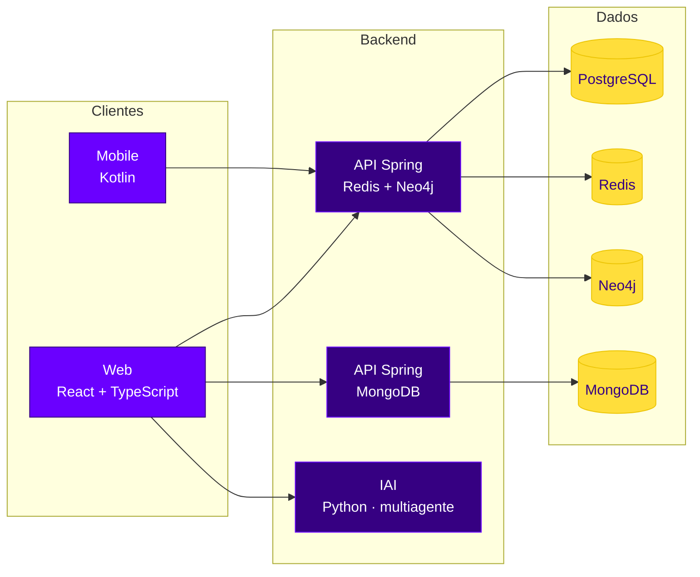

  

  

  

<b>
<a href="#sobre-o-projeto">Sobre</a> ·
<a href="#funcionalidades">Funcionalidades</a> ·
<a href="#ods-12--consumo-e-produção-responsáveis">ODS 12</a> ·
<a href="#arquitetura">Arquitetura</a> ·
<a href="#tecnologias">Tecnologias</a> ·
<a href="#repositórios">Repositórios</a> ·
<a href="#equipe">Equipe</a>
</b>

 

## Sobre o projeto

**Inventra** é um projeto interdisciplinar de Ensino Médio técnico, desenvolvido em 2026 e alinhado ao **ODS 12 — Consumo e Produção Responsáveis** da Agenda 2030 da ONU. A proposta é levar **precisão digital à gestão de estoques de alimentos**, reduzindo o desperdício em restaurantes, cozinhas industriais e outras operações gastronômicas.

<table>
<tr>
<td width="50%" valign="top">

### O problema

Muitas operações de alimentação ainda controlam o estoque de forma informal — por memória, planilhas desatualizadas ou "olhômetro". Isso torna a conferência lenta, reduz a rastreabilidade e aumenta o risco de **compras mal planejadas**, **insumos vencidos** e **desperdício financeiro**.

</td>
<td width="50%" valign="top">

### A solução

Um ecossistema digital de ponta a ponta para **registrar, acompanhar e analisar** o estoque, com indicadores claros e um assistente de IA (**IAI**) que apoia estoquistas, compradores e supervisores no dia a dia.

</td>
</tr>
</table>

**Público-alvo:** equipes de estoque, gerentes, proprietários e compradores de restaurantes e outros serviços de alimentação.

## Funcionalidades

<table>
<tr>
<td align="center" width="25%"><b>Cadastro inteligente</b> Por foto/OCR ou manual</td>
<td align="center" width="25%"><b>Controle de estoque</b> Quantidades e validades</td>
<td align="center" width="25%"><b>Alertas</b> Avisos de vencimento</td>
<td align="center" width="25%"><b>Dashboard</b> Indicadores da operação</td>
</tr>
<tr>
<td align="center"><b>Requisições</b> Pedidos de compra</td>
<td align="center"><b>Histórico</b> Movimentações rastreáveis</td>
<td align="center"><b>IAI</b> Assistente multiagente</td>
<td align="center"><b>Web e mobile</b> Acesso em qualquer lugar</td>
</tr>
</table>

> [!NOTE]
> As telas do produto existem hoje como protótipo de alta fidelidade, com fluxos e regras ainda em especificação e implementação pelas frentes listadas abaixo.

## ODS 12 — Consumo e Produção Responsáveis

| Meta | Descrição | Como o Inventra contribui |
|:-:|---|---|
|  | Redução do desperdício de alimentos | **Foco principal:** evitar que insumos vençam no estoque |
|  | Redução da geração de resíduos | Menos descarte de alimentos e dos recursos usados para produzi-los |
|  | Conscientização para o consumo responsável | Métricas e alertas incentivam uma cultura de gestão consciente |

## Arquitetura

Visão geral das frentes de desenvolvimento. A infraestrutura (Docker e CI/CD com GitHub Actions) é mantida pela frente de Operações Ágeis.

## Tecnologias

  

  

## Repositórios

### 2º ano

| Repositório | Frente | Descrição | Atividade |
|---|---|---|---|
| [**data-modeling**](https://github.com/InventraTech/inventra-data-modeling-2) | Arte e Modelagem de Dados | Modelagem e scripts do banco relacional (PostgreSQL) |  |
| [**spring-redis-neo4j**](https://github.com/InventraTech/inventra-development-spring-redis-neo4j-2) | Desenvolvimento | API em Spring, com Redis e Neo4j |  |
| [**development-mongo**](https://github.com/InventraTech/inventra-development-mongo-2) | Desenvolvimento | API em Spring para o banco não relacional MongoDB |  |
| [**dynamic-applications**](https://github.com/InventraTech/inventra-dynamic-applications-2) | Aplicações Dinâmicas | Front-end em React, TypeScript e Tailwind CSS |  |
| [**artificial-intelligence**](https://github.com/InventraTech/inventra-artificial-intelligence-2) | Inteligência Artificial | Sistema multiagente para estoquistas, compradores e supervisores |  |
| [**mobile-development**](https://github.com/InventraTech/inventra-mobile-development-2) | Desenvolvimento Mobile | Aplicativo mobile do Inventra |  |
| [**agile-operations**](https://github.com/InventraTech/inventra-agile-operations-development-2) | Operações Ágeis | Automação, infraestrutura, conteinerização e implantação |  |
| [**software-engineering**](https://github.com/InventraTech/inventra-software-engineering-2) | Engenharia e Qualidade de Software | Levantamento e documentação de requisitos |  |

<b>1º ano</b> — clique para expandir

 

| Repositório | Disciplina | Descrição |
|---|---|---|
| [**Inventra1-BD**](https://github.com/InventraTech/Inventra1-BD) | Banco de Dados | Projetos de banco de dados do 1º ano |
| [**inventra1-poo**](https://github.com/InventraTech/inventra1-poo) | Programação Orientada a Objetos | Demandas de POO do 1º ano |
| [**Inventra1-POO-LPR**](https://github.com/InventraTech/Inventra1-POO-LPR) | POO / LPR | Projetos de POO/LPR do 1º ano |
| [**Inventra1-HTML**](https://github.com/InventraTech/Inventra1-HTML) | HTML | Projetos de HTML do 1º ano |

O repositório [.github](https://github.com/InventraTech/.github) reúne as configurações padrão da organização: README de perfil, template de Pull Request e workflows de CI/CD reutilizáveis.

## Equipe

### 2º ano

<table>
<tr>
<td align="center" width="150">
<a href="https://github.com/dvarakaki"> <b>Davi Arakaki</b></a> @dvarakaki
</td>
<td align="center" width="150">
<a href="https://github.com/EduardoPassosdeQueiroz"> <b>Eduardo Passos</b></a> @EduardoPassosdeQueiroz
</td>
<td align="center" width="150">
<a href="https://github.com/FelipeKogake"> <b>Felipe Kogake</b></a> @FelipeKogake
</td>
</tr>
<tr>
<td align="center" width="150">
<a href="https://github.com/JonesPrado"> <b>João Victor Prado</b></a> @JonesPrado
</td>
<td align="center" width="150">
<a href="https://github.com/joohnyxxz"> <b>João Vitor Maldonado</b></a> @joohnyxxz
</td>
<td align="center" width="150">
<a href="https://github.com/RafaelPassosQueiroz"> <b>Rafael Passos</b></a> @RafaelPassosQueiroz
</td>
</tr>
</table>

### 1º ano

<table>
<tr>
<td align="center" width="150">
<a href="https://github.com/DelJorgeLlanos"> <b>Jorge Llanos</b></a> @DelJorgeLlanos
</td>
<td align="center" width="150">
<a href="https://github.com/dudaanjos103-cloud"> <b>Maria Eduarda Anjos</b></a> @dudaanjos103-cloud
</td>
<td align="center" width="150">
<a href="https://github.com/erickaraga0"> <b>Erick Aragão</b></a> @erickaraga0
</td>
</tr>
<tr>
<td align="center" width="150">
<a href="https://github.com/GabrielFlavinho"> <b>Gabriel Favrin</b></a> @GabrielFlavinho
</td>
<td align="center" width="150">
<a href="https://github.com/stellacostaf"> <b>Stella Costa</b></a> @stellacostaf
</td>
<td align="center" width="150"></td>
</tr>
</table>

 

Desenvolvido pela equipe <b>Inventra</b> · Alinhado à <a href="https://brasil.un.org/pt-br/sdgs/12">Agenda 2030 da ONU</a>

